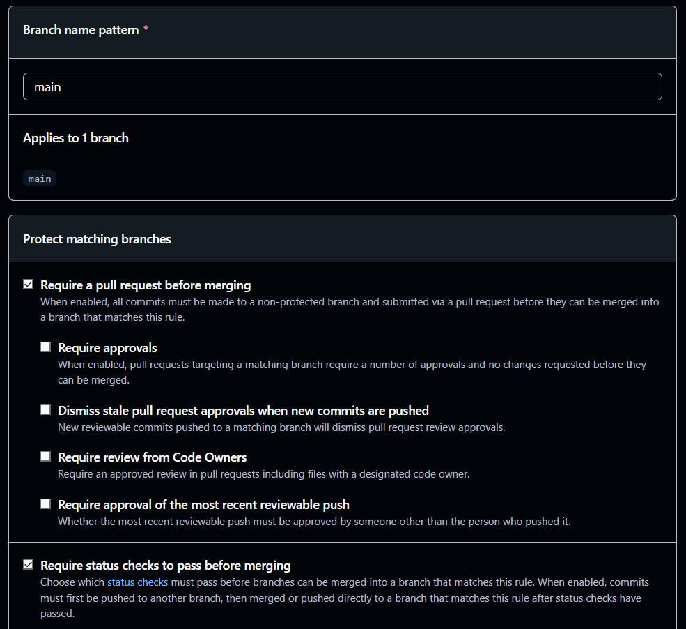

# Currículo Online - DS881

[](https://github.com/RCorrer/ds881-curriculo-GRR20235365/actions/workflows/ci-cd.yml)

## 🌐 Link do currículo em produção (GitHub Pages)

**Meu portfólio está publicado em:**  
[https://rcorrer.github.io/ds881-curriculo-GRR20235365/](https://rcorrer.github.io/ds881-curriculo-GRR20235365/)

---

## 📌 Sobre o projeto

Este repositório contém a **segunda versão do meu portfólio pessoal**, desenvolvido para demonstrar projetos e trabalhos. O projeto foi conteinerizado e possui pipeline de CI/CD automatizado, atendendo aos requisitos da disciplina **DS881**.

**Portfólio original:** [https://windfox8.github.io/portfolio-v2/](https://windfox8.github.io/portfolio-v2/)


---

## 🐳 Executando o ambiente local com Docker

Siga os passos abaixo para executar o projeto em seu computador **sem precisar instalar nenhuma dependência** (como Node.js, SASS, etc.). Tudo roda dentro de um container.

### Pré-requisitos
- [Docker](https://www.docker.com/products/docker-desktop/) instalado
- [Git](https://git-scm.com/) instalado (opcional, para clonar)

### Passo a passo

1. **Clone o repositório**
   ```bash
   git clone https://github.com/RCorrer/ds881-curriculo-GRR20235365.git
   cd ds881-curriculo-GRR20235365

2. **Inicie o servidor de desenvolvimento com Docker Compose**

   ```bash
   docker-compose up

3. **Acesse no navegador**
Abra http://localhost:8080. O servidor possui hot-reload: qualquer alteração no código é refletida automaticamente.

## 🛡️ Proteção da branch `main` (Branch Protection)

Conforme exigido no trabalho, a branch `main` está protegida com as seguintes regras:

- **Require a pull request before merging** – nenhum commit pode ser feito diretamente na `main`. Toda alteração exige um Pull Request.
- **Require status checks to pass before merging** – o merge só é permitido se todos os checks do CI/CD (lint, build) estiverem verdes.

### Evidência da configuração




---

## 🔧 Tecnologias e ferramentas utilizadas

- **HTML5, CSS3, SASS, JavaScript** – front-end do portfólio
- **Docker & Docker Compose** – conteinerização do ambiente de desenvolvimento
- **GitHub Actions** – pipeline de CI/CD (lint, build, deploy)
- **GitHub Pages** – hospedagem do site estático

---

## 📦 Estrutura do pipeline de CI/CD

O arquivo `.github/workflows/ci-cd.yml` executa as seguintes etapas:

1. **Lint** – verifica sintaxe dos arquivos HTML e JS.
2. **Build** – compila SASS para CSS e prepara a pasta `site/` com todos os arquivos necessários (HTML, CSS, JS, imagens).
3. **Deploy** – publica o conteúdo da pasta `site/` no GitHub Pages (após merges na `main`).

---

## 📝 Licença

Este projeto é de uso pessoal e educacional.  
Desenvolvido por **Rafael Fernando Nunho Correr**.
